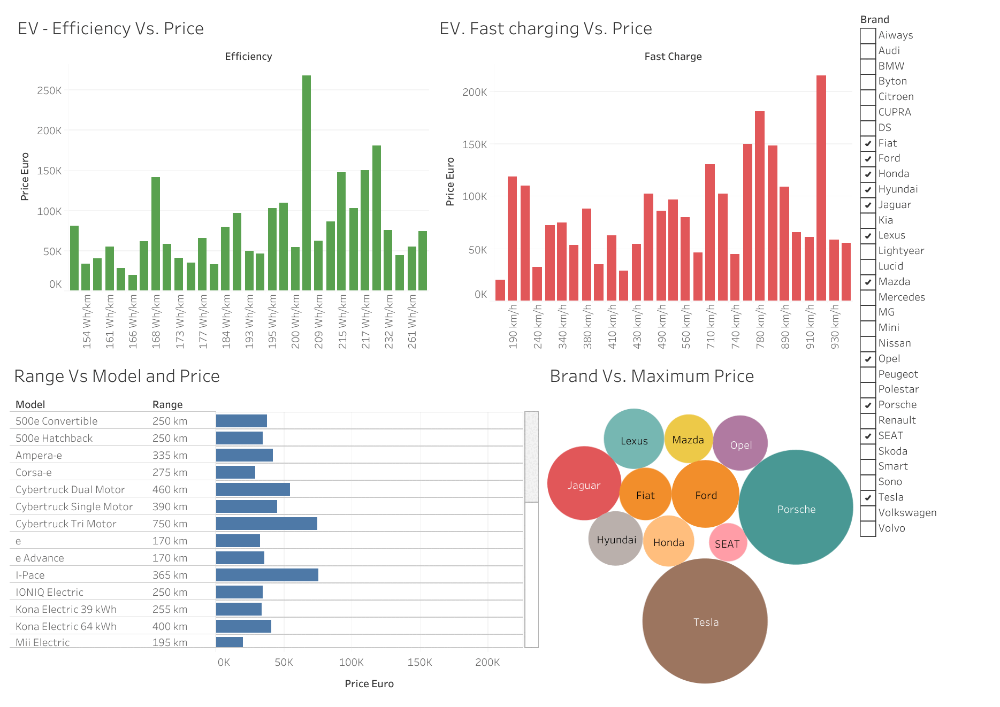

# Electric Vehicle Statistics by 2020

We use basic tableau worksheets to create dashboard with an aim to understand the what costs the price of the electric vehicle (EV). We have used the important features such as  efficiency, vehicle charging rate and the brands. With filtered on brand we are able to visualize it effect on the efficiency and the charging rate. We provided the online data we used along with the tableau worksheet. 

The working sheet of the  created bashboard is shown below

 